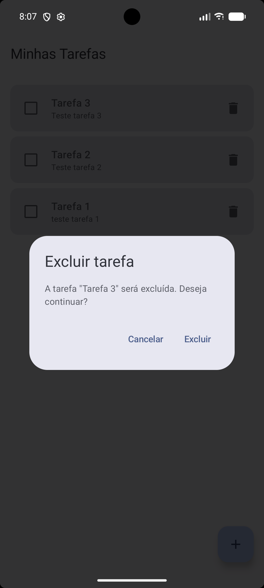
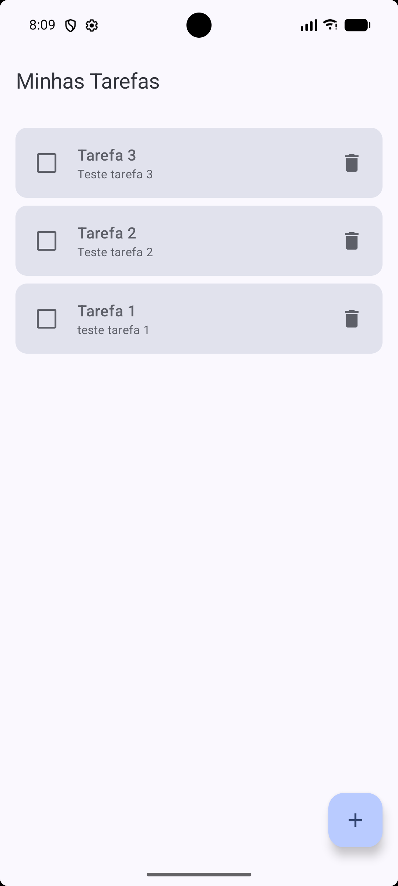
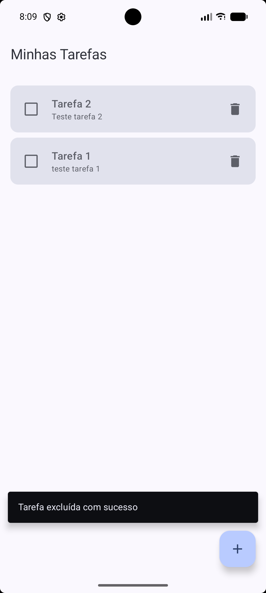
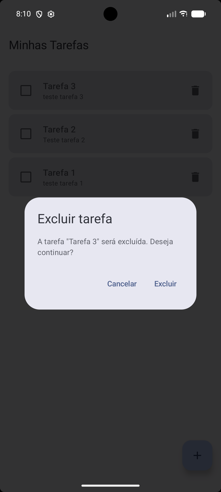

# Evidências — Confirmação de Exclusão de Tarefas

Este documento reúne as evidências visuais da implementação do fluxo de **confirmação de exclusão de tarefas**, conforme solicitado na prova prática.

O fluxo funciona assim: ao tocar no ícone de lixeira, um diálogo do Material 3 é exibido sobre a própria tela de lista, informando qual tarefa será excluída. O usuário pode **cancelar** (nada é alterado) ou **excluir** (a tarefa é removida e uma mensagem de confirmação é exibida).

---

## 1. Lista antes da exclusão

Estado inicial da lista de tarefas, antes de qualquer ação de exclusão.

---

## 2. Diálogo aberto com a tarefa selecionada

Ao tocar no ícone de lixeira de uma tarefa, o diálogo de confirmação é aberto exibindo o título da tarefa selecionada.

---

## 3. Resultado ao cancelar

Ao tocar em **Cancelar**, o diálogo é fechado e a lista permanece inalterada — nenhuma tarefa é removida.

---

## 4. Nova abertura do diálogo

O diálogo é aberto novamente para a mesma tarefa, demonstrando que o fluxo pode ser repetido normalmente.

---

## 5. Resultado após confirmar a exclusão

Ao tocar em **Excluir**, a tarefa selecionada é removida da lista e uma mensagem de confirmação ("Tarefa excluída com sucesso") é exibida.

---

## Resumo do fluxo

| Etapa | Ação | Resultado esperado |
|---|---|---|
| 1 | Tocar no ícone de lixeira | Diálogo de confirmação é exibido |
| 2 | Tocar em **Cancelar** | Diálogo fecha, lista permanece igual |
| 3 | Tocar no ícone de lixeira novamente | Diálogo é exibido novamente |
| 4 | Tocar em **Excluir** | Tarefa é removida e mensagem de sucesso é exibida |
